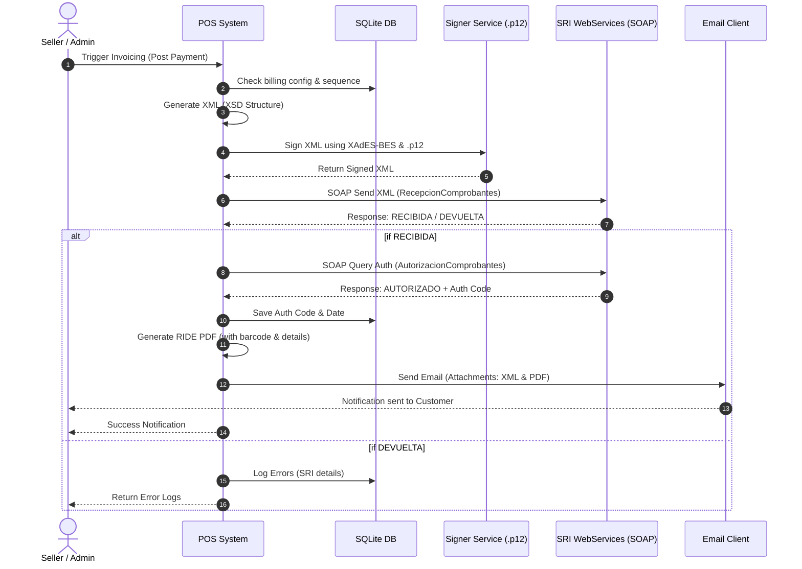

# Feature Specification: Ecuadorian Electronic Invoicing (SRI)

**Feature Branch**: `013-ecuadorian-electronic-billing`

**Created**: 2026-06-22

**Status**: Draft

---

## 1. Feature Description & Context

FlexDash POS needs to incorporate an electronic invoicing module compliant with the requirements of the Servicio de Rentas Internas (SRI) of Ecuador. This module serves two purposes:
1. **Tenant-Level Billing**: Allows each tenant (company) to configure their electronic signature, sequences, and issue electronic invoices (Facturas) to their customers.
2. **Platform-Level Billing**: Allows the SaaS SuperAdmin to configure their own electronic signature, and automatically generate and send electronic invoices to company subscribers upon approving their plan subscription payments.

### Localization Adjustments (Ecuador Focus)
The application will pivot its terminology and fields to Ecuadorian specifications:
- **Identification Types**: Any identification inputs (e.g. for Partners/Customers/Suppliers, and Company registration) must support:
  - **Cédula de Identidad (CI)** (10 digits)
  - **Registro Único de Contribuyentes (RUC)** (13 digits)
  - **Pasaporte** (Alphanumeric)
- **Taxes**: Standard calculation references must align with IVA (0%, 12%, 15%) and support the concept of taxable bases.

### Electronic Invoicing Flow (SRI Offline Model)
The electronic invoicing process contains the following steps:
1. **Generate XML**: Build the document payload in XML format adhering to the SRI XSD schema (Factura v2.1.0).
2. **Sign XML (XAdES-BES)**: Cryptographically sign the XML structure using a `.p12` digital certificate (PKCS#12 format) and the user's password.
3. **Send to SRI SOAP Reception**: Send the signed XML payload via SOAP to the SRI Reception Web Service. The response will return `RECIBIDA` or `DEVUELTA` (with error details).
4. **Query SRI SOAP Authorization**: Retrieve the authorization state of the invoice from the SRI Authorization Web Service. The response will return `AUTORIZADO` (with an authorization number and date) or `NO AUTORIZADO`.
5. **Generate RIDE (PDF)**: Generate the Representación Impresa del Documento Electrónico (RIDE) PDF document, including the 49-digit access key, numerical barcode, tax summary, and company logo.
6. **Notify Customer**: Automatically email the customer, attaching the authorized XML file and the RIDE PDF.

---

## 2. User Stories & Acceptance Criteria

### User Story 1: Tenant Electronic Billing Configuration
> **As a** Company Owner,
> **I want to** configure my electronic signature and invoice parameters in a billing settings panel,
> **So that** I can begin issuing legal electronic invoices.

#### Acceptance Criteria:
- A new section **"Facturación Electrónica"** is added to Settings.
- The company owner can:
  - Upload their digital signature certificate file (`.p12`).
  - Enter the certificate password (stored encrypted in the database).
  - Click "Validar Firma" which decrypts the certificate temporarily, verifies the password, extracts the owner name, and calculates/displays the certificate expiration date.
  - Set the 3-digit **Establecimiento** code (e.g., `001`).
  - Set the 3-digit **Punto de Emisión** code (e.g., `001`).
  - Set the initial sequential number (e.g. `000000001`).
  - Select the SRI environment (`Pruebas` / `Producción`).

### User Story 2: Subscription Plan Module Restrictions
> **As a** SaaS Platform Owner,
> **I want to** restrict access to the electronic billing module based on the tenant's subscription plan,
> **So that** electronic invoicing can be sold as a premium feature tier.

#### Acceptance Criteria:
- Subscription plans specify a boolean `has_electronic_billing` and a monthly invoice limit.
- If a company's plan does not support electronic billing:
  - The "Facturación Electrónica" configuration menu is hidden or disabled.
  - Users trying to access billing configuration or invoice generation receive a `403 Forbidden` response.
  - An option to purchase/upgrade the plan is suggested.

### User Story 3: Invoicing a POS Sale
> **As a** Cashier / Store Seller,
> **I want to** trigger the electronic invoice generation for a sale after payment has been fully recorded,
> **So that** I do not issue legal documents for unpaid or draft transactions.

#### Acceptance Criteria:
- Invoicing is not automatic on checkout; instead, it is an explicit step after payment.
- The Sales detail view and Sales list view show a **"Emitir Factura Electrónica"** button *only* if:
  - The sale's payment status is `completed` (or cash has been received/box matches).
  - The sale has not been invoiced yet (no associated invoice record exists).
- Clicking the button launches a queued background job (`ProcessElectronicInvoice`) that performs the 6-step SRI flow.
- A status badge on the sale displays: `Pendiente`, `Firmado`, `Enviado`, `Autorizado`, `Devuelto`, or `Rechazado`.
- If an invoice fails reception or authorization (e.g., `DEVUELTA` or `NO AUTORIZADO`), the error log/message returned by the SRI must be clearly displayed, allowing the seller to fix customer data and retry.

### User Story 4: Platform Subscription Invoicing (SuperAdmin)
> **As a** SuperAdmin,
> **I want to** configure my own platform electronic billing settings and automatically invoice company subscribers when their payment is approved,
> **So that** the SaaS platform complies with tax laws automatically.

#### Acceptance Criteria:
- SuperAdmin has a dedicated panel to upload their platform `.p12` certificate, configure platform establishment/emission point numbers, password, and sequences.
- In the SuperAdmin Payments validation screen, when a payment receipt uploaded by a company for a plan subscription is approved (status goes from `pending` to `approved`):
  - An option / button **"Emitir Factura al Suscriptor"** becomes available.
  - Clicking this triggers the platform-level invoicing flow using SuperAdmin billing parameters.
  - The invoice is generated with the company's RUC/CI, name, and email, and the PDF/XML are sent directly to the company owner's registered email.

---

## 3. Core Technical Workflows

---

## 4. Proposed Database Changes

### `billing_configs` (New Table)
Stores billing configuration for tenants and the platform itself:
- `id` (Primary Key, integer)
- `company_id` (Integer, nullable - null value represents SuperAdmin settings)
- `certificate_path` (String, secure path to saved .p12 file)
- `certificate_password` (String, encrypted password)
- `certificate_expires_at` (DateTime, expiration date computed on save)
- `establishment` (String, 3 digits, e.g., '001')
- `emission_point` (String, 3 digits, e.g., '001')
- `last_sequence` (Integer, tracking of next sequence number)
- `environment` (Enum: 'pruebas', 'produccion')
- `is_active` (Boolean)
- `created_at`, `updated_at` (Timestamps)

### `electronic_invoices` (New Table)
Tracks each document issued:
- `id` (Primary Key, integer)
- `company_id` (Integer, nullable - null for platform-issued subscription invoices)
- `invoicable_type` (String, morph link: e.g., `App\Modules\Sale\Models\Sale` or `App\Models\SubscriptionPayment`)
- `invoicable_id` (Integer, morph link ID)
- `access_key` (String, 49-digit unique access key containing date, type, RUC, env, series, sequence, code, type of emission)
- `sequence` (String, full sequence: e.g., '001-001-000000001')
- `status` (Enum: 'draft', 'signed', 'received', 'authorized', 'failed')
- `xml_path` (String, path to authorized XML file)
- `pdf_path` (String, path to RIDE PDF file)
- `sri_error_details` (Text, logs of SRI reasons if validation or authorization fails)
- `authorized_at` (DateTime, timestamp of SRI approval)
- `created_at`, `updated_at` (Timestamps)

---

## 5. Security Constraints
1. **Certificate Protection**: `.p12` certificates must be stored in a non-public folder inside storage (e.g., `storage/app/secure_certificates/`).
2. **Password Cryptography**: Passwords must be encrypted using `Crypt::encryptString()` and never stored as plain text. Only decrypted in memory at runtime when executing signature actions.
3. **Environment Isolation**: A sandbox endpoint (SRI test environment) must be strictly enforced unless specifically toggled to `produccion` by the administrator.
