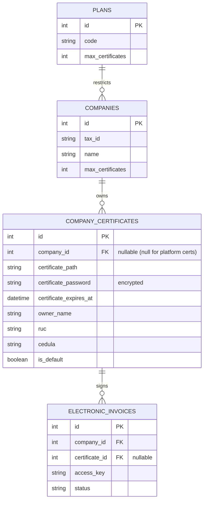

# Feature Specification: Multi-Certificate Electronic Invoicing

**Feature Branch**: `014-multi-certificate-billing`

**Created**: 2026-06-22

**Status**: Draft

---

## 1. Feature Description & Context

Currently, each company (tenant) and the platform itself can only associate a single digital certificate (.p12) for signing electronic invoices. 

This specification introduces **Multi-Certificate support**, enabling companies to upload, store, and manage multiple digital certificates. This is critical for businesses operating with different establishmets or representatives requiring distinct signature profiles.

### Key Rules
1. **Plan Limits**: The maximum number of active certificates a company can maintain is constrained by their subscription plan:
   - **Basic Plan**: Maximum 1 certificate.
   - **Standard Plan**: Maximum 3 certificates.
   - **Premium Plan**: Unlimited certificates.
2. **Default Certificate**: There must always be exactly one certificate marked as the **default** certificate. This default certificate is automatically selected by the system to sign invoices.
3. **Billing Integration**: When manually emitting an electronic invoice, cashiers/sellers should have the option to override the default certificate and select any other valid certificate associated with their company.
4. **RUC Validation**: Every uploaded certificate must have its metadata validated against the company's RUC (`tax_id`) or owner Cédula, preventing incorrect signature assignments.

---

## 2. User Stories & Acceptance Criteria

### User Story 1: Certificate Management & Listing
> **As a** Company Owner,
> **I want to** view a list of all my uploaded digital certificates,
> **So that** I can track their owners, RUCs, and expiration dates.

#### Acceptance Criteria:
- The settings page displays a table or list of all uploaded certificates.
- For each certificate, the list displays:
  - Owner Name (extracted from certificate subject CN/O).
  - Associated RUC or Cédula.
  - Expiration Date (and a status badge: Active, Expired, or Expiring Soon).
  - **Default Badge**: A clear visual indicator showing which certificate is set as default.
  - **Acciones**: Buttons to "Set as Default" and "Delete".

### User Story 2: Plan Limit Enforcement
> **As a** Company Owner,
> **I want to** be restricted from uploading more certificates than my subscription plan allows,
> **So that** I comply with my plan restrictions.

#### Acceptance Criteria:
- When the company attempts to upload a new certificate, the system checks the plan's limit (`max_certificates`).
- If the limit has been reached:
  - The "Upload" button is disabled or displays an upgrade warning.
  - Submitting the upload request returns a validation error requesting a plan upgrade.

### User Story 3: Default Certificate Rule
> **As a** Company Owner,
> **I want** the system to enforce that exactly one certificate is set as default,
> **So that** electronic invoicing is never left without a valid signature.

#### Acceptance Criteria:
- If a company has only 1 certificate, it is automatically marked as `default` (non-modifiable).
- When uploading a new certificate, the user can check a box "Establecer como predeterminado".
- Setting a certificate as default clears the default status from any other certificate.
- Users cannot delete the certificate that is currently marked as default unless they first set another certificate as default, or if it is the only certificate remaining.

### User Story 4: Dynamic Certificate Selection on Invoicing
> **As a** Seller / Cashier,
> **I want to** select which certificate to sign a specific invoice with,
> **So that** I can sign using the representative corresponding to the establishment or point of emission.

#### Acceptance Criteria:
- When clicking "Emitir Factura Electrónica" from the POS checkout or Sale details:
  - The system defaults to the company's default certificate.
  - A dropdown option allows selecting any of the company's other active certificates.
- The signed invoice log records the `certificate_id` used for the signature.

---

## 3. Proposed Database Changes

### Table Changes & Migrations

#### `plans` (Columns Added)
- `max_certificates` (Integer, default `1`)

#### `companies` (Columns Added)
- `max_certificates` (Integer, nullable - overrides plan limit if set)

#### `company_certificates` (New Table)
- `id` (PK, integer)
- `company_id` (Integer, nullable, FK to `companies`)
- `certificate_path` (String)
- `certificate_password` (String, encrypted)
- `certificate_expires_at` (DateTime)
- `owner_name` (String)
- `ruc` (String, nullable)
- `cedula` (String, nullable)
- `is_default` (Boolean, default `false`)
- `created_at`, `updated_at` (Timestamps)

#### `electronic_invoices` (Columns Added)
- `certificate_id` (Integer, nullable, FK to `company_certificates`)

---

## 4. Security & Validation Constraints
1. **Authentication**: All endpoints relating to certificate uploads, deletion, and default toggles require JWT validation (`auth.jwt`) and admin/owner authorization.
2. **Tax ID Matching**: Certificates must match the company's `tax_id` (either matching the full RUC or matching the first 10 digits as Cédula).
3. **Password Security**: Certificate passwords are encrypted in the database using Laravel's `Crypt::encryptString()` mutators.
