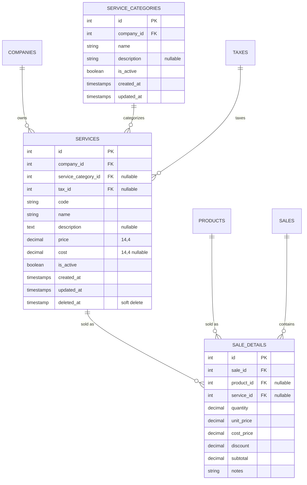

# Feature Specification: Catálogo de Servicios

**Feature Branch**: `015-service-catalog`

**Created**: 2026-06-23

**Status**: Draft

**Input**: User description: "Crear una sección para los servicios que ofrece la empresa. Los servicios pueden ser agregados a ventas y facturados, con opción de grabar impuestos. Disponible para todos los planes de suscripción."

---

## 1. Feature Description & Context

Currently, FlexDash POS only supports selling physical **products** (`products` table) with inventory tracking. However, many businesses also offer **services** (e.g., installation, maintenance, consulting, delivery) that need to be quoted, sold, and invoiced alongside products.

This specification introduces a **Service Catalog** module that allows companies to create, manage, and sell services. Services differ from products in that:
- They have **no stock/inventory** tracking.
- They have a **price** but no **cost** for margin calculations (optionally a cost can be set for profitability tracking).
- They can optionally be assigned a **tax** (IVA) just like products.
- They can be added as line items in **sales** and **purchases** alongside products.
- They are included in **electronic invoices** following SRI regulations.

### Key Rules
1. **Available to All Plans**: The service catalog is available to all subscription plans (Basic, Standard, Premium) without module restrictions.
2. **Tax Flexibility**: Each service can be associated with a tax rate (IVA) or set as tax-exempt (`tax_id = null`), just like products.
3. **Multi-Tenant**: Services are scoped per company (`company_id`) using the existing `BelongsToCompany` trait.
4. **Sale Integration**: Services can be added as detail lines (`sale_details`) in sales, coexisting with product lines in the same sale.
5. **Electronic Invoicing**: Services included in sales are reflected in the electronic invoice XML as non-physical items with their corresponding tax treatment.

---

## 2. User Stories & Acceptance Criteria

### User Story 1 - Gestión del Catálogo de Servicios (Priority: P1)
> **As a** Company Owner / Admin,
> **I want to** create, list, edit, and deactivate services my company offers,
> **So that** I can maintain an organized catalog of services available for sale.

**Why this priority**: Without a service catalog, no services can be sold. This is the foundational capability.

**Independent Test**: Can be fully tested by navigating to the services section, creating a service with name/price/tax, and verifying it appears in the list.

**Acceptance Scenarios**:

1. **Given** the user is authenticated and on the services page, **When** they click "Nuevo Servicio", **Then** a form/modal appears with fields: code, name, description, price, cost (optional), tax, and is_active toggle.
2. **Given** the user fills in valid service data with a tax selected, **When** they submit the form, **Then** the service is created and appears in the service list with the tax rate displayed.
3. **Given** the user fills in valid service data with no tax selected (exento), **When** they submit the form, **Then** the service is created with `tax_id = null` and shows "Exento" in the tax column.
4. **Given** a service exists and is referenced in a sale, **When** the user tries to delete it, **Then** the system prevents deletion and suggests deactivation instead.
5. **Given** a service is deactivated (`is_active = false`), **When** the user views the POS or sale creation form, **Then** the service does NOT appear in the available items list.

---

### User Story 2 - Agregar Servicios a Ventas (Priority: P1)
> **As a** Seller / Cashier,
> **I want to** add services as line items in a sale alongside products,
> **So that** I can create a single invoice that includes both products and services.

**Why this priority**: This is the core value proposition — selling services alongside products. Equal priority with US1.

**Independent Test**: Can be tested by creating a sale that includes a product and a service, verifying totals calculate correctly.

**Acceptance Scenarios**:

1. **Given** the user is creating a new sale, **When** they search for items to add, **Then** the search results include both products and services, visually differentiated (e.g., badge or icon).
2. **Given** a service is added to the sale, **When** the user sets a quantity and price, **Then** the subtotal calculates correctly: `quantity × unit_price`.
3. **Given** the service has a tax assigned, **When** the sale is approved, **Then** the tax amount includes the service's tax contribution.
4. **Given** the service has NO tax assigned (exento), **When** the sale is approved, **Then** the service line does NOT contribute to the tax total.
5. **Given** a sale has both products and services, **When** the sale is approved, **Then** inventory is deducted ONLY for products, NOT for services.

---

### User Story 3 - Facturación Electrónica de Servicios (Priority: P2)
> **As a** Company Owner,
> **I want** services included in sales to be properly represented in electronic invoices,
> **So that** my invoices comply with SRI regulations.

**Why this priority**: Depends on US2 being complete. Important for compliance but builds on top of existing invoicing.

**Independent Test**: Can be tested by emitting an electronic invoice for a sale containing services and verifying the XML contains the correct line items.

**Acceptance Scenarios**:

1. **Given** a sale with services is approved, **When** an electronic invoice is emitted, **Then** each service line appears in the XML `<detalles>` section with `codigoPrincipal` set to the service's code.
2. **Given** a service has IVA assigned, **When** the XML is generated, **Then** the service line includes the correct `<impuestos>` block with the IVA rate and amount.
3. **Given** a service is tax-exempt, **When** the XML is generated, **Then** the service line includes `<impuestos>` with IVA rate `0` and tarifa code `0` (tarifa 0%).
4. **Given** a sale PDF (RIDE) is generated, **When** it contains services, **Then** the services are listed as line items with their respective codes, descriptions, and amounts.

---

### User Story 4 - Servicios en Catálogo de Configuración (Priority: P3)
> **As a** Company Owner,
> **I want to** manage service categories from the existing catalog settings page,
> **So that** I can organize my services by type.

**Why this priority**: Nice to have for organization. Can function without categories initially.

**Independent Test**: Can be tested by creating a service category in settings and assigning it to a service.

**Acceptance Scenarios**:

1. **Given** the user is on `/settings/catalogs`, **When** they view the tabs, **Then** a new tab "Categorías de Servicios" is available.
2. **Given** the user creates a service category, **When** they create a new service, **Then** the category appears in the service form dropdown.

---

### Edge Cases

- What happens when a service with the same code already exists for the company? → Validation error with `UniqueForCompany` rule.
- What happens when a service is part of an approved sale and the user tries to edit the service price? → The sale detail retains the price at the time of sale; editing the service updates only future sales.
- How does the system handle a sale with ONLY services (no products)? → Sale is valid; no inventory movements are generated.
- What happens when a service's tax is changed after it was used in a sale? → Historical sale details retain the original tax; only new sales use the updated tax.

---

## 3. Requirements

### Functional Requirements

- **FR-001**: System MUST allow CRUD operations for services scoped to the authenticated company.
- **FR-002**: System MUST support optional tax assignment (IVA) per service, identical to product tax handling.
- **FR-003**: System MUST allow services to be added as line items in sales alongside products.
- **FR-004**: System MUST NOT create inventory movements for service line items in sales.
- **FR-005**: System MUST include services in electronic invoice XML generation with correct tax codes.
- **FR-006**: System MUST make the service catalog available to ALL subscription plans without module restrictions.
- **FR-007**: System MUST enforce unique service codes per company using the `UniqueForCompany` rule.
- **FR-008**: System MUST support soft deletes and `is_active` toggle for services.
- **FR-009**: System MUST display services in the sale creation form alongside products with visual differentiation.

### Key Entities

- **Service**: Represents a service offered by a company. Key attributes: `code`, `name`, `description`, `price`, `cost` (optional), `tax_id` (optional), `is_active`, `company_id`.
- **ServiceCategory** *(optional, P3)*: Categorizes services. Key attributes: `name`, `description`, `is_active`, `company_id`.
- **SaleDetail** *(modified)*: Extended to support either a `product_id` or a `service_id` (one of the two, polymorphic or dual nullable FK).

---

## 4. Proposed Database Changes

### Table Changes & Migrations

#### `services` (New Table)
- `id` (PK, auto-increment)
- `company_id` (FK to `companies`, NOT NULL)
- `service_category_id` (Integer, nullable, FK to `service_categories`)
- `tax_id` (Integer, nullable, FK to `taxes`)
- `code` (String, max 50)
- `name` (String, max 200)
- `description` (Text, nullable)
- `price` (Decimal 14,4, default 0)
- `cost` (Decimal 14,4, default 0)
- `is_active` (Boolean, default true)
- `created_at`, `updated_at` (Timestamps)
- `deleted_at` (SoftDeletes)
- Unique constraint: `code` + `company_id` (enforced at app layer via `UniqueForCompany`)

#### `service_categories` (New Table)
- `id` (PK, auto-increment)
- `company_id` (FK to `companies`, NOT NULL)
- `name` (String, max 100)
- `description` (String, nullable)
- `is_active` (Boolean, default true)
- `created_at`, `updated_at` (Timestamps)

#### `sale_details` (Columns Modified)
- `product_id` (change from NOT NULL to nullable FK)
- `service_id` (new, Integer, nullable, FK to `services`)
- Constraint: Exactly one of `product_id` or `service_id` must be set (enforced at application layer).

---

## 5. Security & Validation Constraints
1. **Authentication**: All service management endpoints require JWT validation (`auth.jwt`) and admin/owner authorization.
2. **Multi-Tenant Isolation**: All queries scoped by `company_id` via `BelongsToCompany` trait and global scope.
3. **Code Uniqueness**: Service codes validated using `UniqueForCompany` rule at the request validation layer.
4. **Referential Integrity**: Services referenced in `sale_details` cannot be hard-deleted; only deactivated via `is_active` toggle or soft deleted.

---

## 6. Success Criteria

### Measurable Outcomes
- **SC-001**: Users can create a service and add it to a sale in under 3 minutes.
- **SC-002**: Sales containing both products and services calculate totals (subtotal, IVA, total) correctly.
- **SC-003**: Electronic invoices including services pass SRI validation without errors.
- **SC-004**: No inventory movements are generated for service line items.
- **SC-005**: Service catalog is accessible from all subscription plans without restrictions.

---

## 7. Assumptions
- The existing `Tax` model and catalog system will be reused for service tax assignment.
- The `SaleDetail` model will be extended with a nullable `service_id` FK rather than implementing a polymorphic `item_type` / `item_id` pattern, keeping the schema simpler and consistent with the existing `product_id` FK.
- The `SaleService` (business service) will be updated to handle service lines without triggering inventory operations.
- The `ElectronicInvoicingService` already generates `<detalles>` from `SaleDetail` records and can be adapted to pull service data when `service_id` is set instead of `product_id`.
